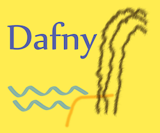

# Dafny

 

Dafny is a **verification-ready programming language**. As you type in your program, Dafny's verifier constantly looks over your shoulder, flags any errors, shows you counterexamples, and congratulates you when your code matches your specifications. When you're done, Dafny can **compile your code to C#, Go, Python, Java, or JavaScript** (more to come!), so it can integrate with your existing workflow.

Dafny will give you **assurance that your code meets the specifications you write**, while letting you write both code and specifications in the Dafny programming language itself. Since verification is an integral part of development, it will thus **reduce the risk of costly late-stage bugs** that are typically missed by testing.

Dafny has support for common programming concepts such as [classes and trait inheritance](https://dafny-lang.github.io/dafny/DafnyRef/DafnyRef#sec-class-types), [inductive datatypes](https://dafny-lang.github.io/dafny/DafnyRef/DafnyRef#181-inductive-datatypes) that can have methods and are suitable for pattern matching, [lazily unbounded datatypes](https://dafny-lang.github.io/dafny/DafnyRef/DafnyRef#182-co-inductive-datatypes), [subset types e.g. for bounded integers](https://dafny-lang.github.io/dafny/DafnyRef/DafnyRef#sec-subset-types), [lambdas](https://dafny-lang.github.io/dafny/DafnyRef/DafnyRef#sec-lambda-expressions), and [immutable and mutable data structures](https://dafny-lang.github.io/dafny/DafnyRef/DafnyRef#sec-collection-types).

Dafny also offers an extensive toolbox for mathematical proofs, such as [unbounded and bounded quantifiers](https://dafny-lang.github.io/dafny/DafnyRef/DafnyRef#sec-forall-statement), [calculational proofs](https://dafny-lang.github.io/dafny/DafnyRef/DafnyRef#1923-calc-statement), [pre- and post-conditions, termination conditions, loop invariants, and read/write specifications](https://dafny-lang.github.io/dafny/DafnyRef/DafnyRef#51-specification-clauses).

This github site contains these materials:

* sources
* [binary downloads](https://github.com/dafny-lang/dafny/releases) for Windows, macOS, GNU/Linux, and FreeBSD
* the [issue tracker](https://github.com/dafny-lang/dafny/issues)
* the wiki, including [frequently asked questions](https://github.com/dafny-lang/dafny/wiki/FAQ)

Documentation about the Dafny language and tools is located
[here](https://dafny-lang.github.io/dafny).
A reference manual is available both [online](https://dafny-lang.github.io/dafny/DafnyRef/DafnyRef) and as [pdf](https://github.com/dafny-lang/dafny/blob/master/docs/DafnyRef/out/DafnyRef.pdf). (A LaTeX version can be produced if needed.)

## Community

You can ask questions about Dafny on [Stack Overflow](https://stackoverflow.com/questions/tagged/dafny) or participate in general discussion on Dafny's .

## Try Dafny

The easiest way to try out Dafny is to [install Dafny on your own machine in Visual Studio Code](https://github.com/dafny-lang/dafny/wiki/INSTALL#visual-studio-code)
and follow along with the [Dafny tutorial](https://dafny-lang.github.io/dafny/OnlineTutorial/guide).
You can also [download and install](https://github.com/dafny-lang/dafny/wiki/INSTALL#install-the-binaries) the Dafny CLI if you prefer to work from the command line.

## Read more

Here are some ways to get started with Dafny:

* 4-part course on the _Basics of specification and verification of code_:
  * Lecture 0: [Pre- and postconditions](https://youtu.be/oLS_y842fMc) (19:08)
  * Lecture 1: [Invariants](https://youtu.be/J0FGb6PyO_k) (20:56)
  * Lecture 2: [Binary search](https://youtu.be/-_tx3lk7yn4) (21:14)
  * Lecture 3: [Dutch National Flag algorithm](https://youtu.be/dQC5m-GZYbk) (20:33)
* New overview article: [Accessible Software Verification with Dafny](https://www.computer.org/csdl/mags/so/2017/06/mso2017060094-abs.html), IEEE Software, Nov/Dec 2017
* [Online tutorial](https://dafny-lang.github.io/dafny/OnlineTutorial/guide), focusing mostly on simple imperative programs
* [3-page tutorial notes](http://leino.science/papers/krml233.pdf) with examples (ICSE 2013)
* Dafny [Quick Reference](https://dafny-lang.github.io/dafny/QuickReference)
* Language reference for the [Dafny type system](http://leino.science/papers/krml243.html), which also describes available expressions for each type
* [Cheatsheet](https://docs.google.com/document/d/1kz5_yqzhrEyXII96eCF1YoHZhnb_6dzv-K3u79bMMis/edit?pref=2&pli=1): basic Dafny syntax on two pages
* Dafny Reference Manual [[html](https://dafny-lang.github.io/dafny/DafnyRef/DafnyRef)] [[pdf](https://github.com/dafny-lang/dafny/blob/master/docs/DafnyRef/out/DafnyRef.pdf)]
* [Dafny libraries](Source/DafnyStandardLibraries/README.md), a standard library of useful Dafny functions and lemmas
* [Dafny Power User](http://leino.science/dafny-power-user)
* Videos at [Verification Corner](https://www.youtube.com/channel/UCP2eLEql4tROYmIYm5mA27A)
* [Blog](https://dafny.org/blog)

The language itself draws pieces of influence from:

* Euclid (from the mindset of a designing a language whose programs are to be verified),
* Eiffel (like the built-in contract features),
* CLU (like its iterators, and inspiration for the out-parameter syntax),
* Java, C#, and Scala (like the classes and traits, and syntax for functions),
* ML (like the module system, and its functions and inductive datatypes), and
* Coq and VeriFast (like the ability to include co-inductive datatypes and being able to write inductive and co-inductive proofs).

## External contributions

* [Haskell-to-Dafny translator](http://www.doc.ic.ac.uk/~dcw/h2d.cgi), by Duncan White
* [Vim-loves-Dafny mode](https://github.com/mlr-msft/vim-loves-dafny) for vim, by Michael Lowell Roberts
* [Boogie-Friends Emacs mode](https://github.com/boogie-org/boogie-friends)

## Contributors

Information and instructions for potential contributors are provided [here](CONTRIBUTING.md).

## License

Dafny itself is licensed under the MIT license. (See `LICENSE.txt` in the root
directory for details.) The subdirectory `Source/Dafny/Coco` contains third
party material; see `Source/DafnyCore/Coco/LICENSE.txt` for more details.
