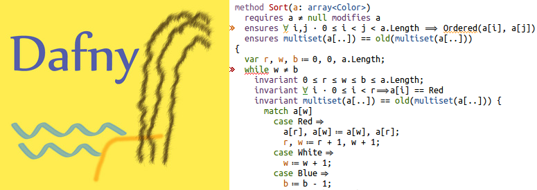

 

Dafny is a programming language with a program verifier. As you type in your program, the verifier constantly looks over your shoulders and flags any errors. This github site contains these materials:

* sources
* [binary downloads](https://github.com/dafny-lang/dafny/releases) for Windows, macOS, GNU/Linux, and FreeBSD
* the [issue tracker](https://github.com/dafny-lang/dafny/issues)
* the wiki, including [frequently asked questions](https://github.com/dafny-lang/dafny/wiki/FAQ)

Documentation about the dafny language and tools is located
[here](https://dafny-lang.github.io/dafny).
A reference manual is available both [online](https://dafny-lang.github.io/dafny/DafnyRef/DafnyRef) and as [pdf](https://github.com/dafny-lang/dafny/blob/master/docs/DafnyRef/out/DafnyRef.pdf). (A LaTeX version can be produced if needed.)

# Community

You can ask questions about Dafny on [Stack Overflow](https://stackoverflow.com/questions/tagged/dafny) or participate in general discussion on Dafny's .

# Try Dafny

The easiest way to try out Dafny is to [install Dafny on your own machine in Visual Studio Code](https://github.com/dafny-lang/dafny/wiki/INSTALL#visual-studio-code)
and follow along with the [Dafny tutorial](https://dafny-lang.github.io/dafny/OnlineTutorial/guide).
You can also [download and install](https://github.com/dafny-lang/dafny/wiki/INSTALL#install-the-binaries) the Dafny CLI if you prefer to work from the command line.

# Read more

Here are some ways to get started with Dafny:

* 4-part course on the _Basics of specification and verification of code_:
  - Lecture 0: [Pre- and postconditions](https://youtu.be/oLS_y842fMc) (19:08)
  - Lecture 1: [Invariants](https://youtu.be/J0FGb6PyO_k) (20:56)
  - Lecture 2: [Binary search](https://youtu.be/-_tx3lk7yn4) (21:14)
  - Lecture 3: [Dutch National Flag algorithm](https://youtu.be/dQC5m-GZYbk) (20:33)
* New overview article: [Accessible Software Verification with Dafny](https://www.computer.org/csdl/mags/so/2017/06/mso2017060094-abs.html), IEEE Software, Nov/Dec 2017
* [Online tutorial](https://dafny-lang.github.io/dafny/OnlineTutorial/guide), focusing mostly on simple imperative programs
* [3-page tutorial notes](http://leino.science/papers/krml233.pdf) with examples (ICSE 2013)
* Dafny [Quick Reference](https://dafny-lang.github.io/dafny/QuickReference)
* Language reference for the [Dafny type system](http://leino.science/papers/krml243.html), which also describes available expressions for each type
* [Cheatsheet](https://docs.google.com/document/d/1kz5_yqzhrEyXII96eCF1YoHZhnb_6dzv-K3u79bMMis/edit?pref=2&pli=1): basic Dafny syntax on two pages
* Dafny Reference Manual [[html](https://dafny-lang.github.io/dafny/DafnyRef/DafnyRef)] [[pdf](https://github.com/dafny-lang/dafny/blob/master/docs/DafnyRef/out/DafnyRef.pdf)]
* [Dafny libraries](https://github.com/dafny-lang/libraries), a standard library of useful Dafny functions and lemmas
* [Dafny Power User](http://leino.science/dafny-power-user)
* Videos at [Verification Corner](https://www.youtube.com/channel/UCP2eLEql4tROYmIYm5mA27A)

The language itself draws pieces of influence from:

* Euclid (from the mindset of a designing a language whose programs are to be verified),
* Eiffel (like the built-in contract features),
* CLU (like its iterators, and inspiration for the out-parameter syntax),
* Java, C#, and Scala (like the classes and traits, and syntax for functions),
* ML (like the module system, and its functions and inductive datatypes), and
* Coq and VeriFast (like the ability to include co-inductive datatypes and being able to write inductive and co-inductive proofs).

# External contributions

* [Haskell-to-Dafny translator](http://www.doc.ic.ac.uk/~dcw/h2d.cgi), by Duncan White
* [Vim-loves-Dafny mode](https://github.com/mlr-msft/vim-loves-dafny) for vim, by Michael Lowell Roberts
* [Boogie-Friends Emacs mode](https://github.com/boogie-org/boogie-friends)

# Contributors

To enforce some basic style conventions, we've adopted [pre-commit](https://pre-commit.com/).  We're
using [their default hooks](https://github.com/pre-commit/pre-commit-hooks).  When you clone
Dafny, install pre-commit as per [the instructions](https://pre-commit.com/#install).
For example, on macOS you do

    $ brew install pre-commit

Then run

    $ pre-commit install

This will install pre-commit hooks in your .git/hooks directory.

# License

Dafny itself is licensed under the MIT license. (See LICENSE.txt in the root directory for details.) The subdirectory `third_party` contains third party material; see NOTICES.txt for more details.
