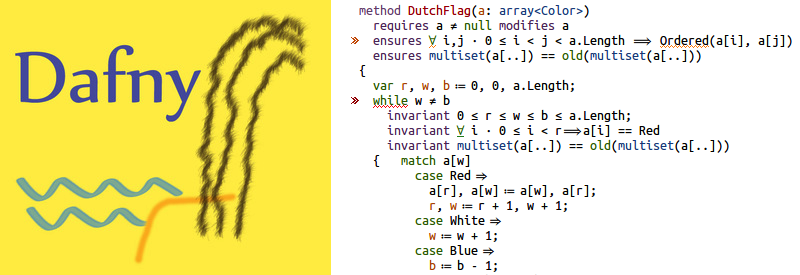

<link rel="stylesheet" href="assets/main.css">

**Quick Links:**
- [Dafny Reference Manual and User Guide](DafnyRef/DafnyRef)
- [Index to Dafny Resources for Users](toc) ([installation](https://github.com/dafny-lang/dafny/wiki/INSTALL) [Dafny for VSCode](https://marketplace.visualstudio.com/items?itemName=dafny-lang.ide-vscode))
- [Dafny GitHub project (for developers of the Dafny tools themselves)](https://github.com/dafny-lang/dafny)

Dafny is a **verification-ready programming language**.
As you type in your program, Dafny's verifier constantly looks over your shoulder, flags any errors, shows you counterexamples, and congratulates you when your code matches your specifications.
When you're done, Dafny can **compile your code to C#, Java, JavaScript, C++ or Go** (more to come!), so it can integrate with your existing workflow.

Dafny will give you **assurance that your code meets the specifications you write**, while letting you write both code and specifications in the Dafny programming language itself.
Since verification is an integral part of development, it will thus **reduce the risk of costly late-stage bugs** that are typically missed by testing.

Dafny has support for common programming concepts such as 
- mathematical iand bounded integers and reals, bit-vectors, classes, iterators, arrays, tuples, generic types, refinement and inheritance
- [inductive datatypes](https://dafny.org/dafny/DafnyRef/DafnyRef#sec-inductive-datatypes) that can have methods and are suitable for pattern matching,
- [lazily unbounded datatypes](https://dafny.org/dafny/DafnyRef/DafnyRef#sec-co-inductive-datatypes),
- [subset types](https://dafny.org/dafny/DafnyRef/DafnyRef#sec-subset-types), such as for bounded integers,
- [lambda expressions](https://dafny.org/dafny/DafnyRef/DafnyRef#sec-lambda-expressions) and functional programming idioms,
- and [immutable and mutable data structures](https://dafny.org/dafny/DafnyRef/DafnyRef#sec-collection-types).

Dafny also offers an extensive toolbox for mathematical proofs about software, including
- [bounded and unbounded quantifiers](https://dafny.org/dafny/DafnyRef/DafnyRef#sec-forall-statement"),
- [calculational proofs](https://dafny.org/dafny/DafnyRef/DafnyRef#sec-calc-statement) and ability to use and prove lemmas,
- [pre- and post-conditions, termination conditions, loop invariants, and read/write specifications](https://dafny.org/dafny/DafnyRef/DafnyRef#sec-specification-clauses)

