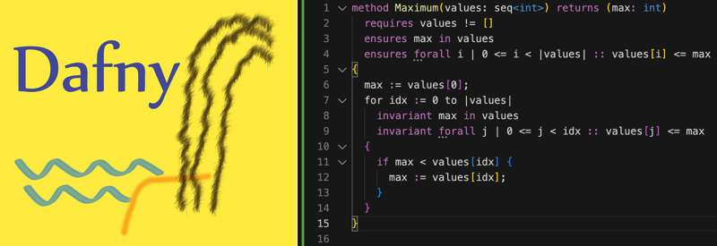

<link rel="stylesheet" href="assets/main.css">

**Dafny** is a verification-aware programming language that has native support for recording specifications and is equipped with a static program verifier. By blending sophisticated automated reasoning with familiar programming idioms and tools, Dafny empowers developers to write provably correct code (w.r.t. specifications),
while also compiling your Dafny code to familiar development environments such as C#, Java, JavaScript and Go (with more in progressi -- Python, C++, Rust) so Dafny can integrate with your existing workflow.

**Quick Links:**
- [**Installation**](https://github.com/dafny-lang/dafny/wiki/INSTALL) ([Dafny for VSCode](https://marketplace.visualstudio.com/items?itemName=dafny-lang.ide-vscode))
- [Dafny Reference Manual and User Guide](DafnyRef/DafnyRef)
- [Dafny Resources for Users](toc)
- [Dafny GitHub project (for developers of the Dafny tools themselves)](https://github.com/dafny-lang/dafny)

In addition to a verification engine to check implementation against specifications, there are several compilers, plugins for common software development IDEs, a LSP-based Language Server, a code formatter, a reference manual, tutorials, power user tips, books, the experiences of professors teaching Dafny, and the accumulating expertise of industrial projects using Dafny.

Dafny will give you **assurance that your code meets the specifications you write**, while letting you write both code and specifications in the Dafny programming language itself.
Since verification is an integral part of development, it will thus **reduce the risk of costly late-stage bugs** that are typically missed by testing.
Sample Dafny code in a Visual Studio IDE is shown next to the logo above.

Dafny has support for common programming concepts such as 
- mathematical and bounded integers and reals, bit-vectors, classes, iterators, arrays, tuples, generic types, refinement and inheritance
- [inductive datatypes](https://dafny.org/dafny/DafnyRef/DafnyRef#sec-inductive-datatypes) that can have methods and are suitable for pattern matching,
- [lazily unbounded datatypes](https://dafny.org/dafny/DafnyRef/DafnyRef#sec-co-inductive-datatypes),
- [subset types](https://dafny.org/dafny/DafnyRef/DafnyRef#sec-subset-types), such as for bounded integers,
- [lambda expressions](https://dafny.org/dafny/DafnyRef/DafnyRef#sec-lambda-expressions) and functional programming idioms,
- and [immutable and mutable data structures](https://dafny.org/dafny/DafnyRef/DafnyRef#sec-collection-types).

Dafny also offers an extensive toolbox for mathematical proofs about software, including
- [bounded and unbounded quantifiers](https://dafny.org/dafny/DafnyRef/DafnyRef#sec-forall-statement"),
- [calculational proofs](https://dafny.org/dafny/DafnyRef/DafnyRef#sec-calc-statement) and ability to use and prove lemmas,
- [pre- and post-conditions, termination conditions, loop invariants, and read/write specifications](https://dafny.org/dafny/DafnyRef/DafnyRef#sec-specification-clauses)

